# LAPORAN MINGGU 12 - MATAKULIAH BIG DATA (  KUIS 2 )

## Dosen Pengampu : 
- Muhammad Shulhan Khairy, S.Kom., M.Kom.

## Disusun Oleh :
- Naila Nabila - 1941720130 ( TI-3F / 16 )

## Link Github : 
- https://github.com/nailanabilaaaaaa/quiz2-mapreduce-3f.git

## Studi Kasus
Pada sebuah toko NellaCelluler, terdapat beberapa data HP yang memiliki field Merek, Tipe, dan Harga HP. Data HP pada NellaCelluler, yaitu :
1. Samsung – Galaxy Z Flip3 ( 15.999.000 ) 
2. iPhone – 13 Pro ( 18.199.000 ) 
3. Samsung – Galaxy Z Fold3 ( 26.999.000 ) 
4. OPPO – Find X2  ( 11.999.000 )
5. Samsung – Galaxy S22+ ( 15.999.000 ) 
6. OPPO – Reno7 ( 7.499.000 ) 
7. Samsung – Galaxy S21+ ( 14.999.000 ) 
8. OPPO – Reno4 ( 4.999.000 ) 
9. iPhone – XS Max ( 12.999.000 ) 
10. OPPO – A96 ( 4.299.000 ) 
11. iPhone – 11 ( 7.999.000 ) 
12. Vivo – T1 Pro ( 4.499.000 ) 
13. iPhone – 12 Pro Max ( 17.799.000 ) 
14. Vivo – X70 Pro ( 10.999.000 )

## Langkah - Langkah

1. Memastikan Hadoop berjalan

    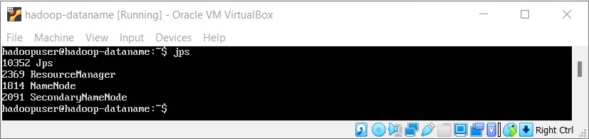

2. Membuat Projek pada Intelij

    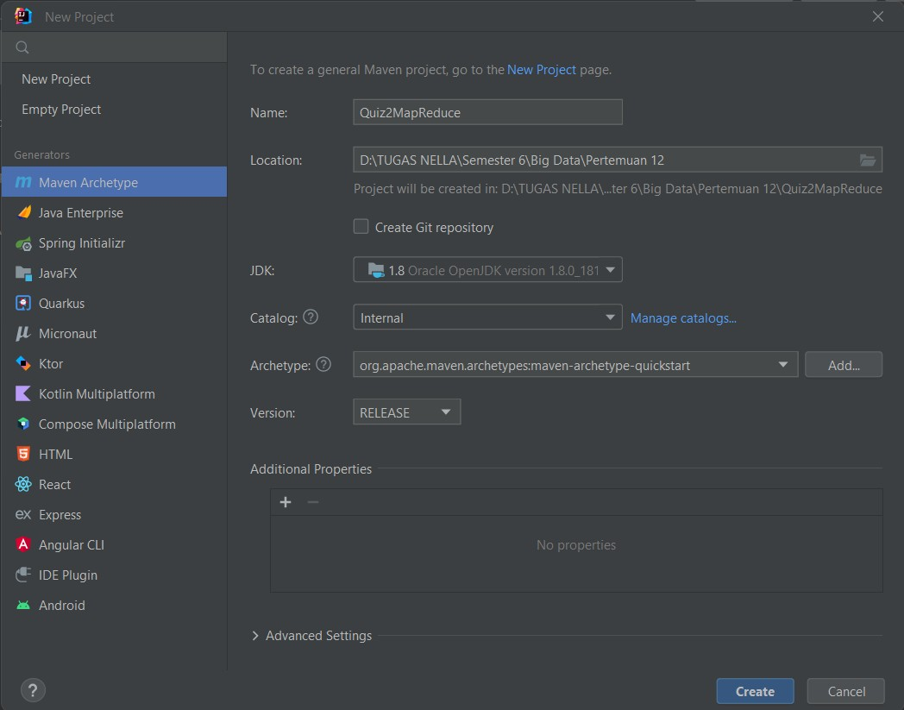

3. Menambahkan Kode Program berikut pada file pom.xml

    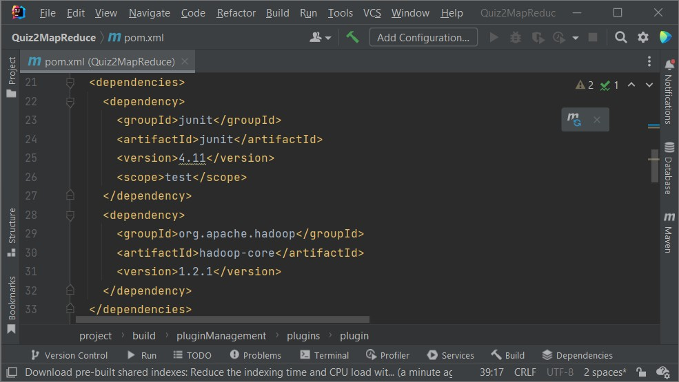

4. Membuat 2 Class baru, yaitu MainMapper.java dan MainReducer.java

    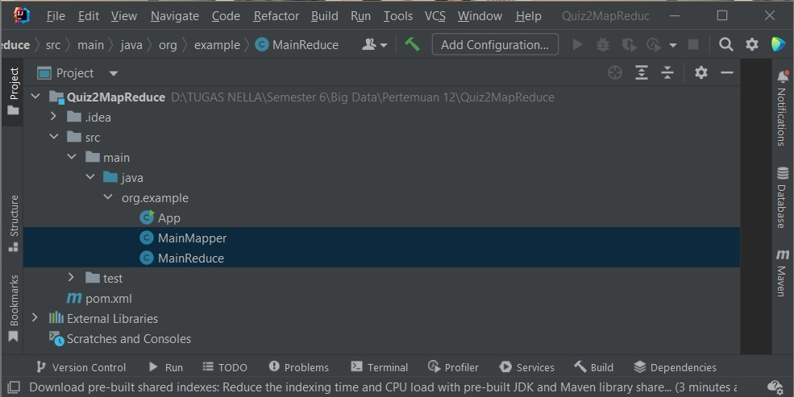

5. Membuat Folder Quiz2, dan File dataHP untuk mengisi data HP yang terdapat pada NellaCelluler

    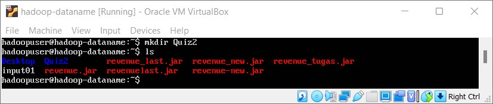

    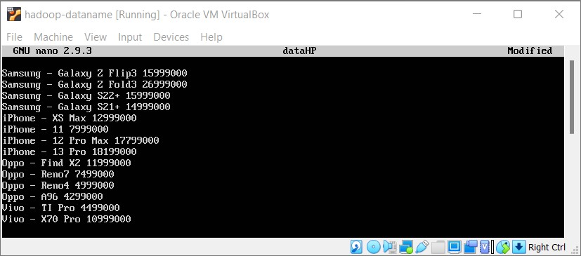

6. Membuat Folder HDFS

    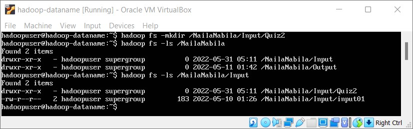

7. Memindahkan File dataHP kedalam Folder HDFS

    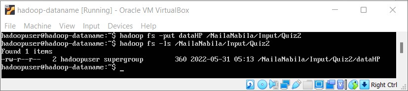

8. Memodifikasi Class MainMapper.java

    

    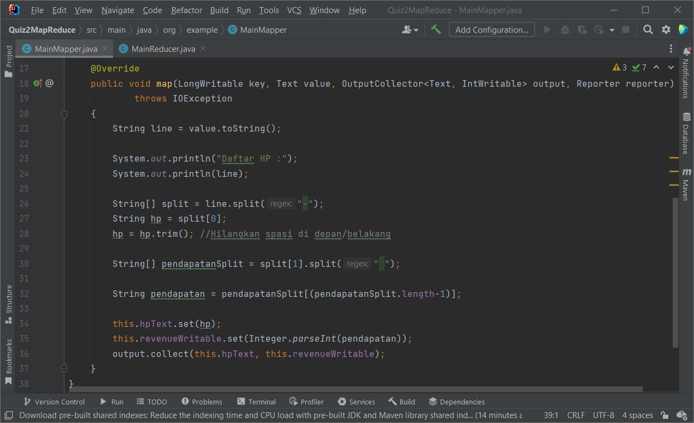

9. Memodifikasi Class MainReducer.java

    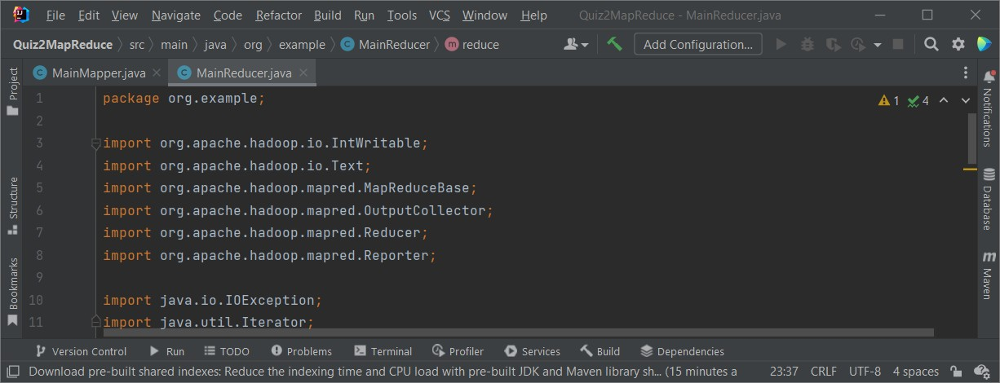

    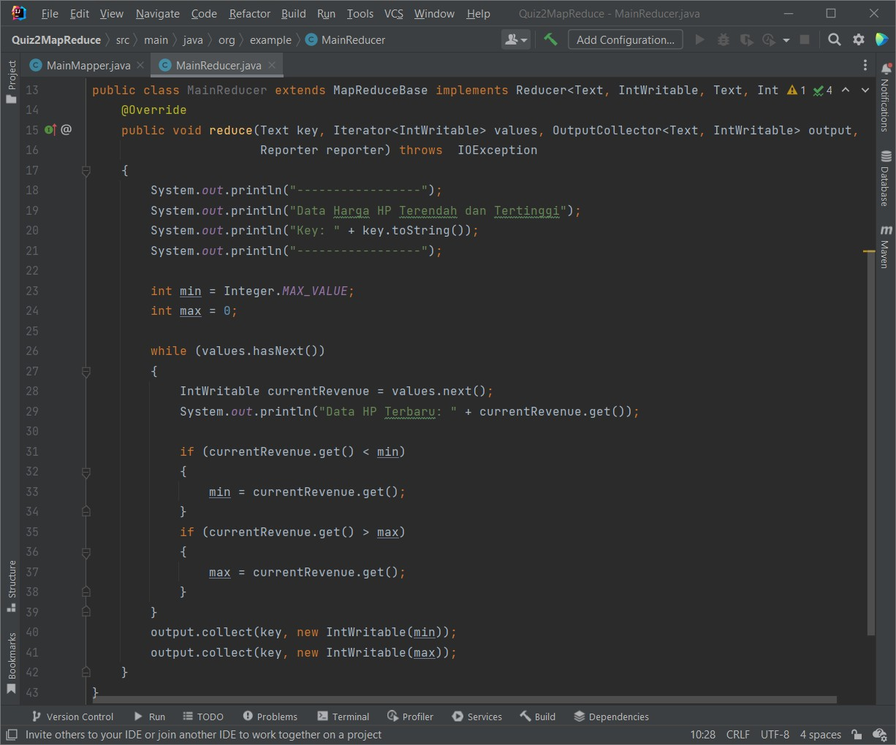

10. Memodifikasi Class App.java

    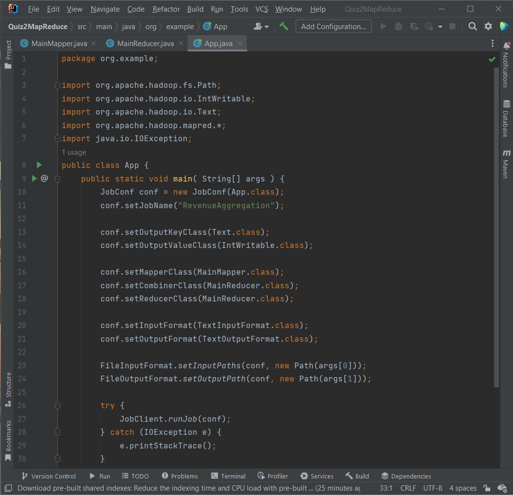
    
11. Membuat File run-job.sh

    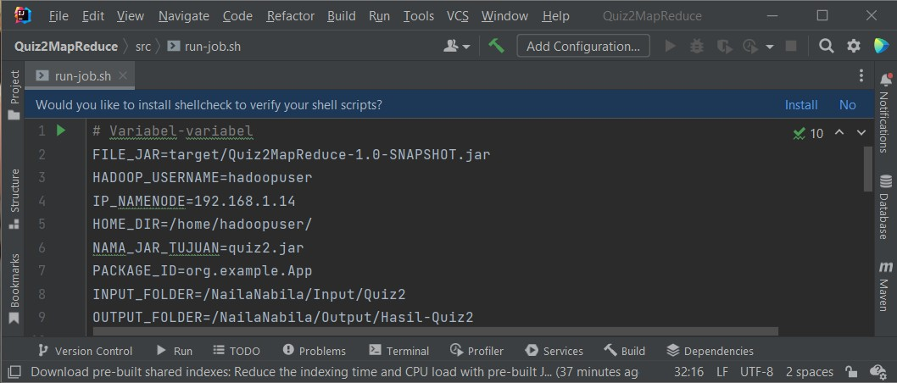

    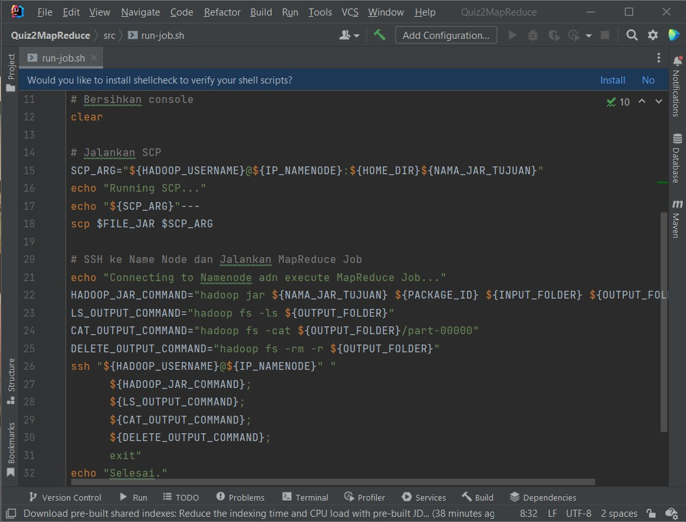

12. Compile dan Build Project

    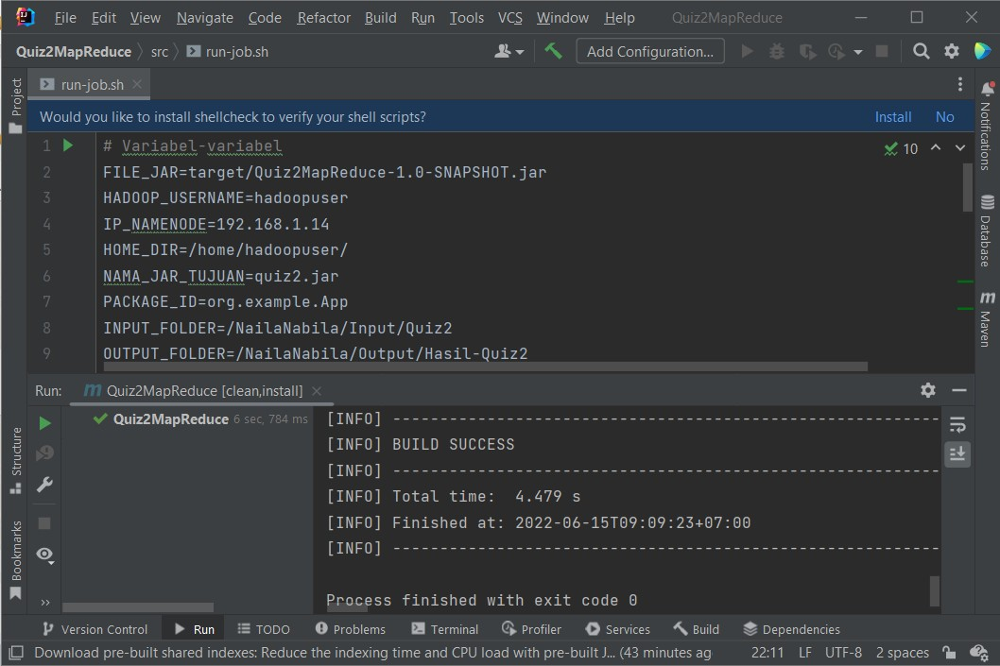

13. Mengeksekusi run-job.sh

    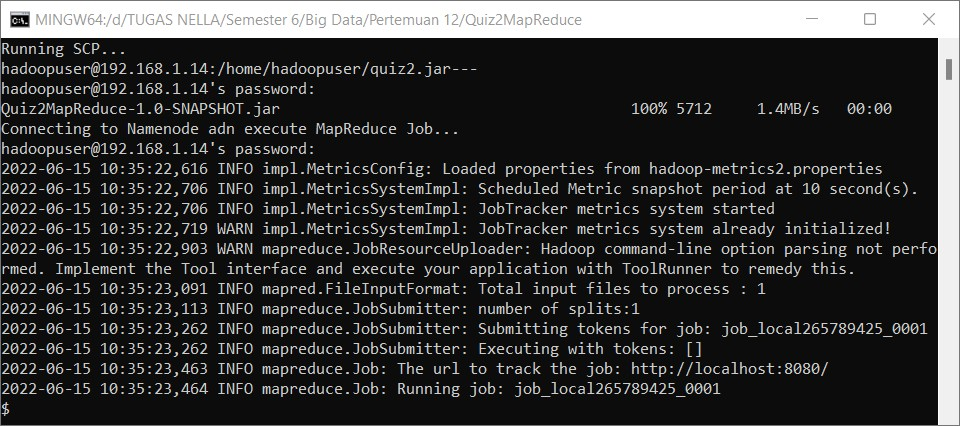

14. Hasil
    - Hasil MainMapper – Daftar HP

        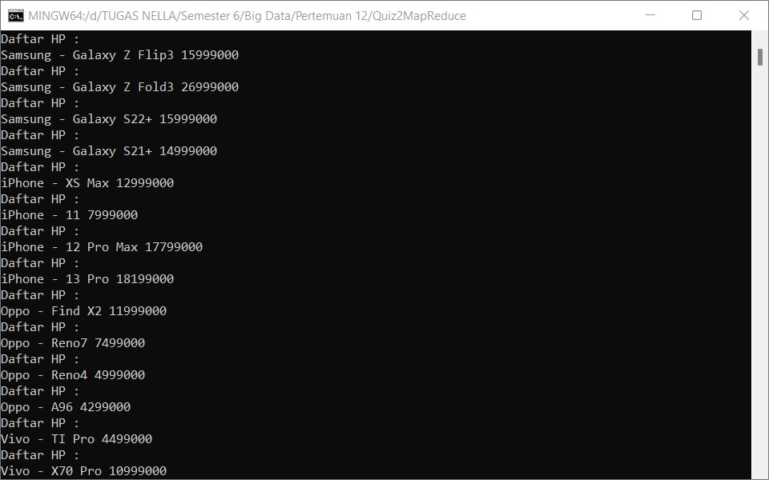

    - Hasil MainReduce – Daftar HP

        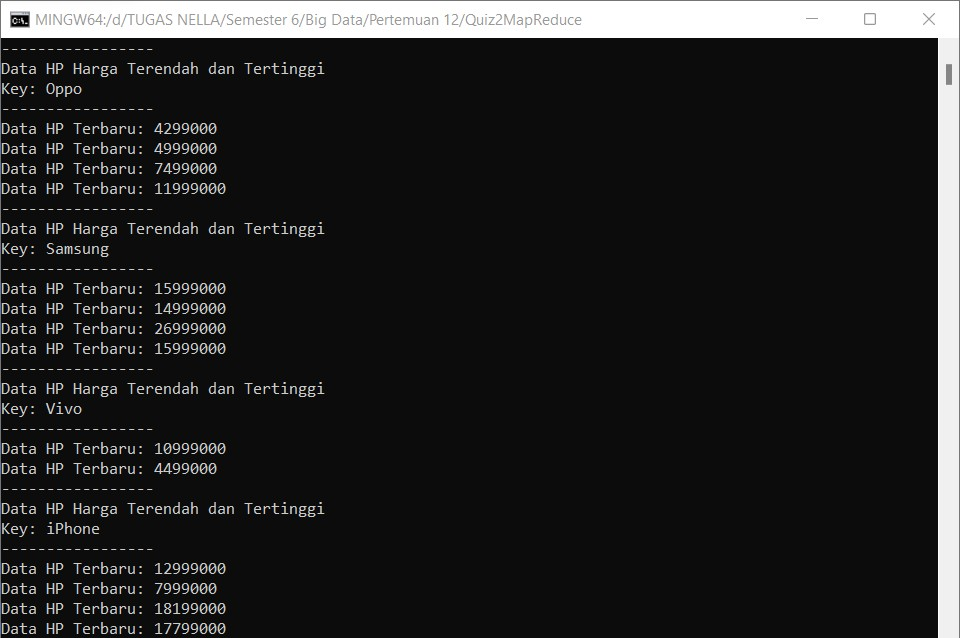

    - Hasil MainReducer – Daftar HP Terendah dan Tertinggi

        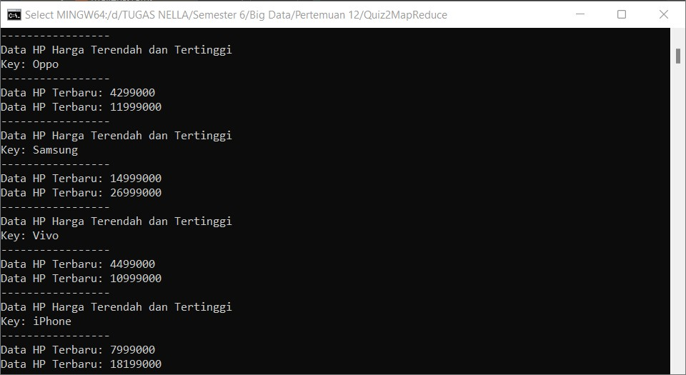

    - Hasil Agregasi

        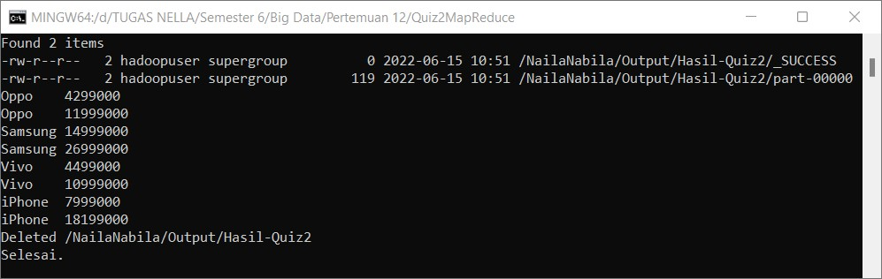