# **Kuis 2 Big Data**

Dhiyashafa Dhiyahasna Hafiza Pranowo

1941720222

TI-3F/09

 

**Studi kasus: Terdapat data makanan ringan pada sebuah minimarket yang memiliki field Nama, No Makanan, dan Harga.**

Dengan data sebagai berikut 

Chitato – 12321 9500

Lays – 23213 12000

Kusuka – 33213 8000

Qtella – 43234 7000

Soyjoy – 53243 9000

Twisko – 63423 10000 

Chitato – 13222 5500

Lays – 21233 9500

Kusuka – 32112 8500

Qtella – 46332 8000

Soyjoy – 50122 10500

Twisko – 61209 9000 

 

1. Memastikan sudah menginstall dan/atau dapat mengakses cluster Hadoop dengan benar dengan mengetik jps setelah merun ssh

   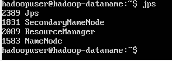

    

2. Buka IDE IntelliJ IDEA dan buatlah proyek baru dengan Bahasa Java dan build framework Maven. Pastikan Anda mencentang pilihan “Create from archetype”. Dan pilih archetype “maven quick-start”. Setelah proyek selesai dibuat. Pada pom.xml tambahkan dependency berikut ini agar kita bisa membuat MapReduce Job. Reload project dengan mengklik ikon `m` di sebelah pojok kanan atas editor

   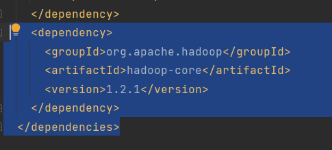

    

3. Buat dua class baru yaitu MainMapper.java dan MainReducer.java

   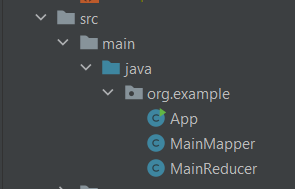

    

4. Akses Name Node cluster melalui SSH, dan buatlah file teks biasa yang diberi nama dataMakanan. 

   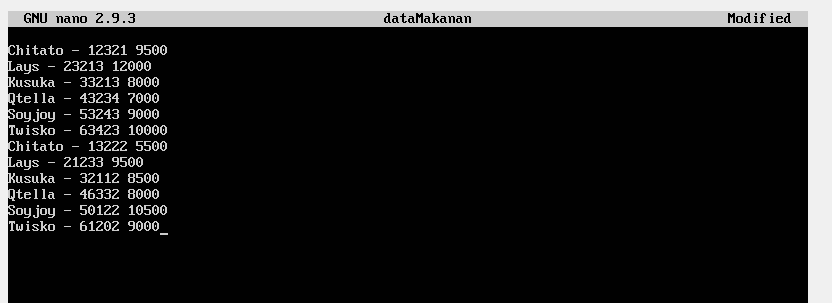

    

5. Membuat folder HDFS

   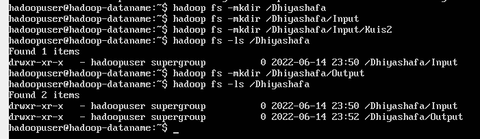

    

6. Menaruh file ke dalam folder

   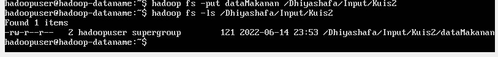

    

7. Mengedit file main mapper, map reducer, dan app

   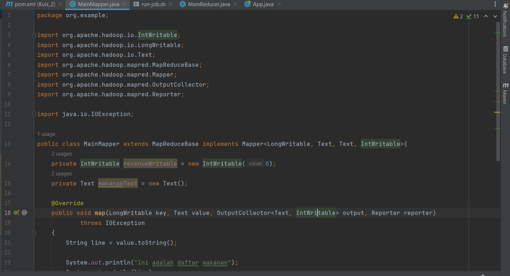
   
   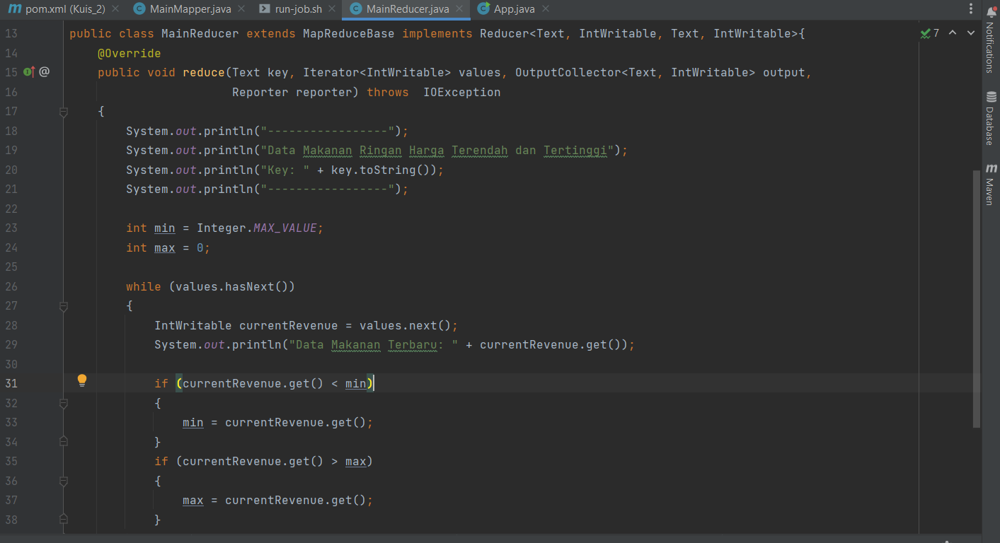
   
   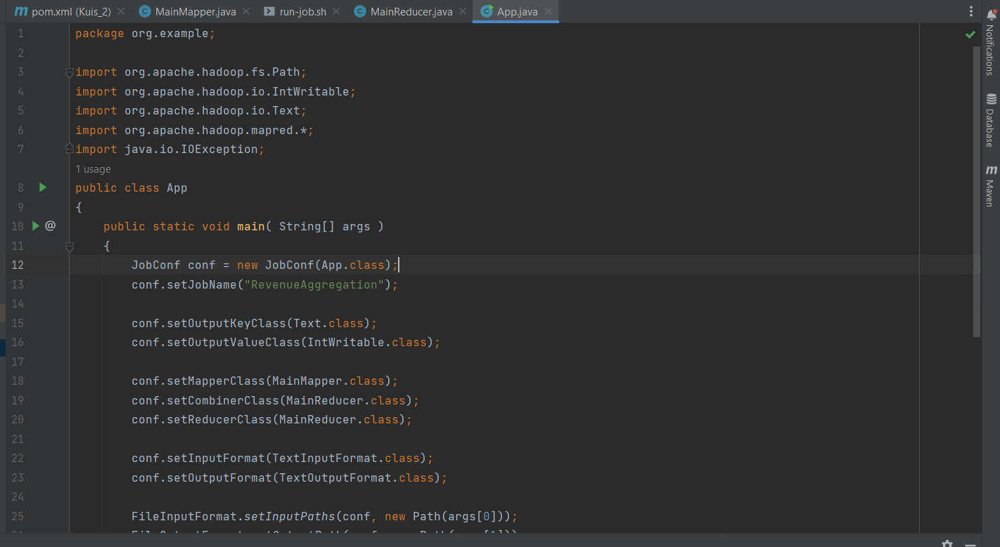

    

8. Run clean dan install pada maven
   
   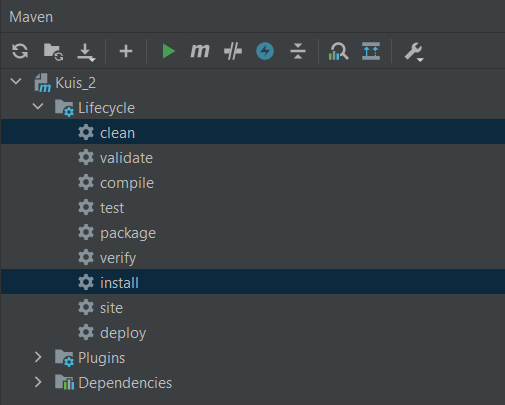

    

9. Membuat file run-job.sh dan isi seperti dibawah
   
   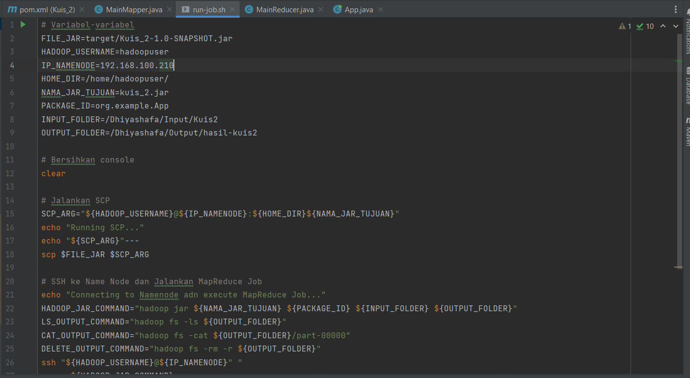

    

10. Hasil run-job.sh

   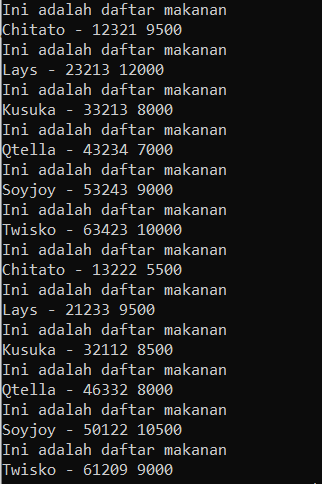

   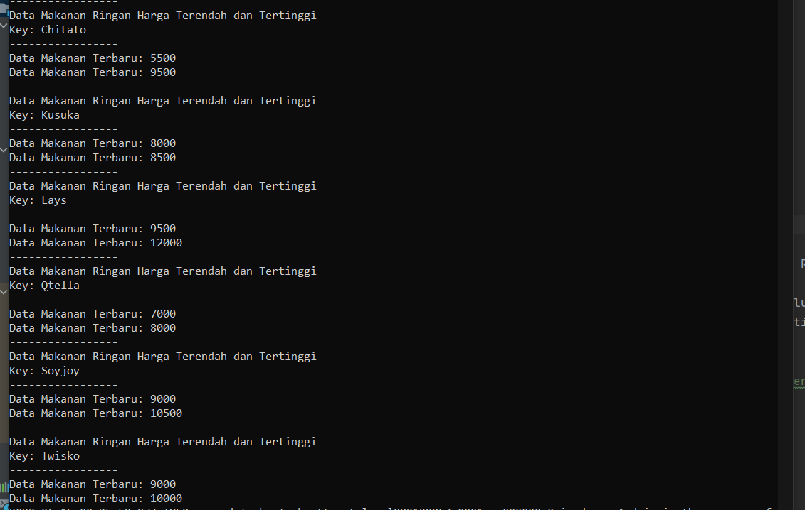
      
   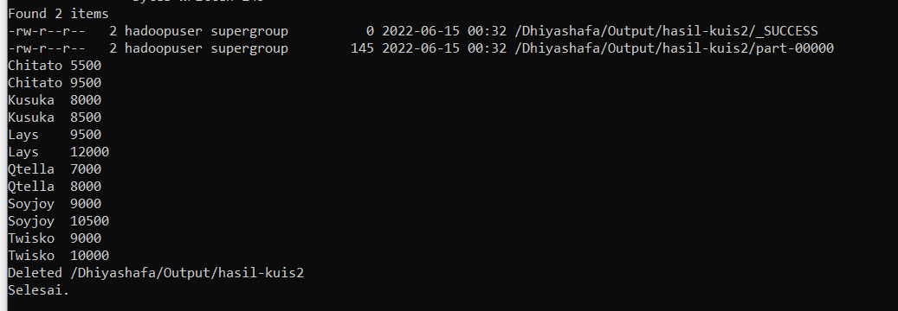
